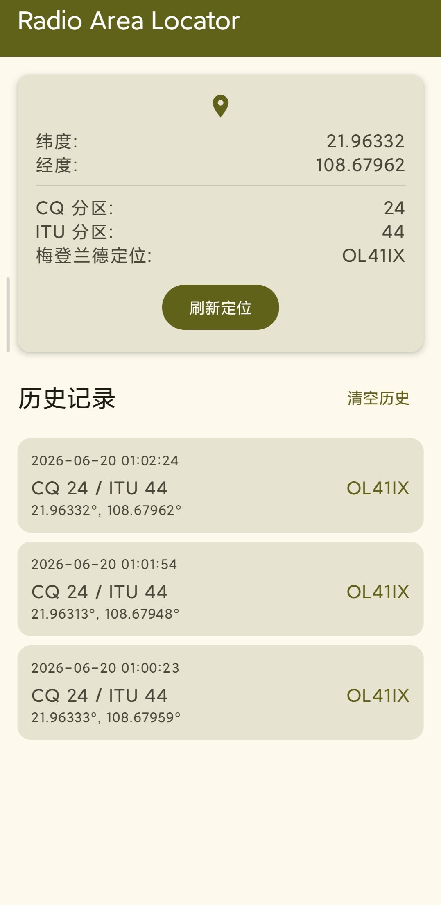

# 双区网络定位 (RadioAreaLocator)

使用 AI 构建的 Android 应用，自动获取手机定位并计算：

- **CQ 分区**（CQ Zone）
- **ITU 分区**（ITU Zone）
- **梅登兰德定位**（Maidenhead Locator）

并基于当前位置预测近期过境的业余无线电卫星。

如有 bug 请在议题中提出，或者发我的 outlook 邮箱（fuxuelingkong@outlook.com）

也可以向我提出功能需求（能力有限，不一定能实现）

## 功能

1. 一键获取当前 GPS 坐标。
2. 自动计算 CQ / ITU 分区和 6 位 Maidenhead 网格。
3. 反向地理编码显示当前位置的地址。
4. 基于当前位置预测近期过境的业余无线电卫星，支持在设置页选择 CelesTrak / SatNOGS / 全部 三种 TLE 数据来源。
5. 提供关于页与设置页。

### 应用截图

## 技术栈

- Kotlin 2.3.20
- Jetpack Compose
- Material Design 3 + Miuix KMP
- Google Play Services Location
- OkHttp（拉取 TLE 数据）
- predict4java（卫星轨道预测）
- kotlinx-coroutines-play-services

## 系统要求

- Android 8.0（API 26）及以上
- targetSdk 36

## 许可证

[MIT License](LICENSE)

## 声明

本人不是HAM，仅是对于业余无线电略为感兴趣，做这个只是周边人是业余无线电爱好者所提出想法，帮助实现而已，顺便学习学习开发过程（考证嘛.......估计高考后再考吧？我也不清楚到底会不会考，毕竟学生还得为学业为重😭😭😭依旧苦命学生族）
